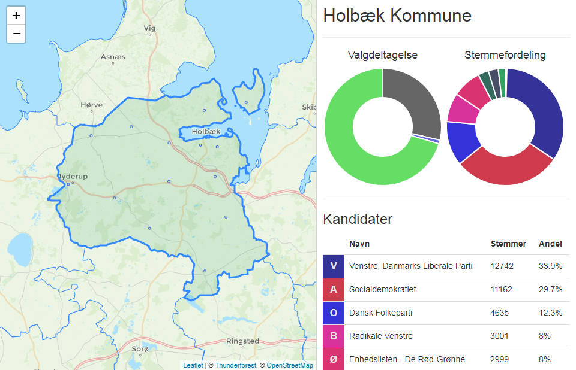

# KMV2013
This project aims to provide a visual representation of the 2013 municipal election in Denmark

## Data collection and processing
The raw data was scraped from http://www.kmdvalg.dk/kv/2013/ using the project located in [Scraping](Scraping/) using BeautifulSoup, and can be found in [data/raw/](data/raw/).
The processing of this data more or less just involves cutting out all the information that isn't relevant to the site, and compressing it into arrays instead of dictionaries to avoid keys bloating the data that has to be downloaded by the end user. The processed election data ends up in [data/election/](data/election/) and is split into [municipalities.json](data/election/municipalities.json) and [locations.json](data/election/locations.json) respectively.

GeoJson data for the boundaries of the danish municipalities were downloaded from https://wambachers-osm.website/boundaries/ and can be found in [data/boundaries-raw](data/boundaries-raw). The GeoJson boundary data is simplified using Python and the shapely library.

The location data for the individual voting locations was gathered using the addresses provided by the raw election data being fed into Google's geocoding API to get LatLng positions. This turned out to be very messy since a lot of the address fields included instructions about where to approach the location from, and if it had been moved, so in the end about 200 of the 1500 total locations had to be verified or edited manually. The partially geocoded data can be found in [data/geocoded](data/geocoded/) and the manually corrected data can be found in [data/geocoded-corrected/](data/geocoded-corrected). The GeoJson-ified location data can be found in [data/locations/](data/locations/)

Finally the data from all of this is compiled into a single [data.js](Web/data.js) file, by basically concatenating the final data files from the other processing steps, and making it into valid js so it can be loaded as such.

## Visualization
For visualization I'm using http://leafletjs.com for the map itself, http://thunderforest.com/ for the tile layers, as mentioned, the boundary data is originally from https://wambachers-osm.website/boundaries/, and for the pie charts on the website, I'm using http://www.chartjs.org/

## Live demo
The website is currently live at https://kmv2013.pius.io/
